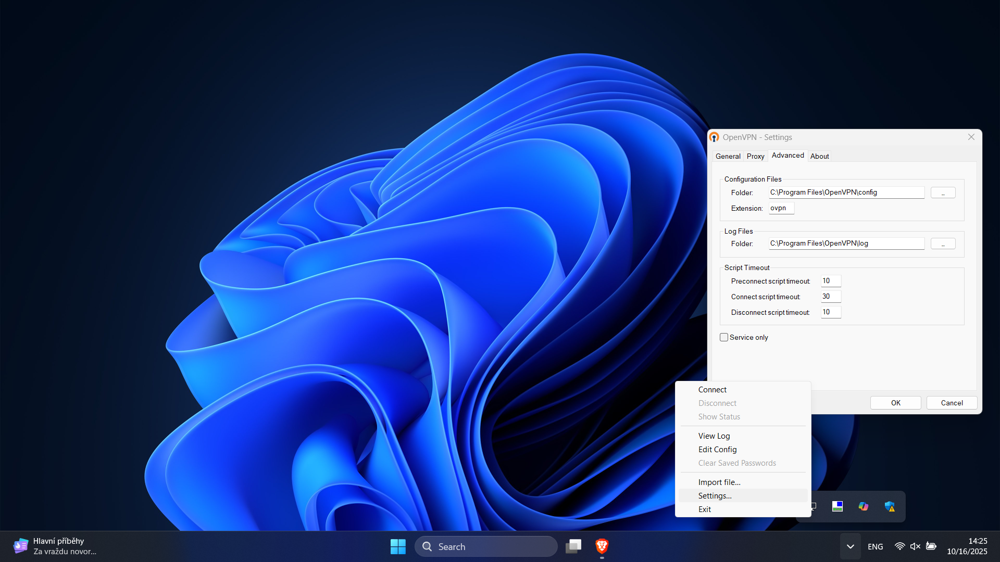
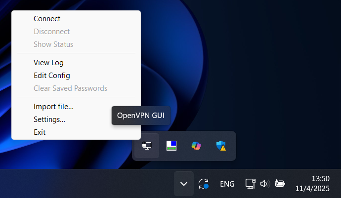

# How to install and setup OpenVPN
## Windows (x86_64)
0. Send me an email asking for the VPN certificate. I will send you an __.ovpn__ file which will be your certificate.
1. Download the installation file from the [webpage](https://openvpn.net/community/) or Alga drive at `\\192.168.1.2.\programs\VPN\OpenVPN\OpenVPN-x.x.x-I0001-amd64.msi`
2. Run the __OpenVPN-x.x.x-I0001-amd64.msi__ installation file and leave everything as default. Make sure to agree to installing the windows TAP drivers too.
3. Locate the installation folder: it's either `C:\Program Files\OpenVPN` or `C:\Program Files(x86)\OpenVPN`
4. Check if the VPN client is on - this icon must be visible:
    <p align="center">
        
    </p>
5. In case it's not running there are two ways to start it:
    * Go to 'Start' / windows button and start typing `openvpn gui`. After a few letters, OpenVPN GUI application should appear so you just start it.
    * Locate the opvenvpn-gui.exe in the installation directory: `C:\Program Files\OpenVPN\bin\openvpn-gui.exe` and start it.
6. Now right click the OpoenVPN GUI icon and select settings:
    <p align="center">
        
    </p>

    Then go to 'Advanced' and change the: 'Configuration files'->'Folder' to `C:\Program Files\OpenVPN\config` and the 'Log Files'->'Folder' to `C:\Program Files\OpenVPN\log`. (Or use 'Program Files (x86)' instead of 'Program Files' in case the installation folder is in 'Program Files (x86)'.)
7. Import the certificate (the .ovpn file):
    <p align="center">
        
    </p>
    Select the option 'Import file...' and then open the `yoursurname.ovpn` file.
8. If you imported the file successfully you should be all set and done. Now you can just start the VPN by right-clicking the OpenVPN GUI icon and selecting 'Connect'. 
9. A windows with running text should appear. If the connection is successfully created, the window wil close automatically and you are now connected to the Algatech local network.
10. To switch the VPN off just right click the OpenVPN GUI icon again and select 'Disconnect'.
11. The OpenVPN GUI icon should start automatically when starting the PC. You can change this behaviour in the settings.
    <p align="center">
        
    </p>

## Linux
0. Send me an email asking for the VPN certificate. I will send you an __.ovpn__ file which will be your certificate.
1. Install openvpn using your package manager.
2. Start the vpn:
```
sudo openvpn --config /path/to/your/certificate.ovpn
```
